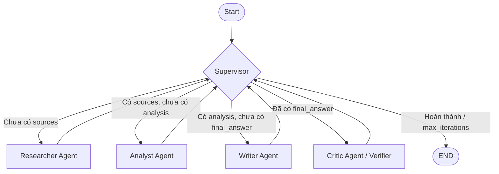

# Multi-Agent Research System — Design Document

## Problem

Hệ thống cần nhận các câu hỏi nghiên cứu kỹ thuật phức tạp (ví dụ: so sánh kiến trúc RAG vs Fine-tuning, phân tích GraphRAG, Multi-Agent orchestration patterns), tự động tìm kiếm tài liệu đáng tin cậy, phân tích tổng hợp thông tin đa chiều, phát hiện mâu thuẫn, và viết một báo cáo chuyên sâu hoàn chỉnh có trích dẫn nguồn chuẩn xác (citation inline `[1]`, `[2]` và bibliography).

## Why multi-agent?

Mô hình **Single-Agent** (chỉ gọi 1 LLM prompt) gặp nhiều giới hạn cố hữu khi xử lý các bài toán nghiên cứu dài và phức tạp:
1. **Context Pollution & Hallucination**: Khi gom toàn bộ việc tìm kiếm, phân tích dữ liệu lớn và hành văn vào 1 prompt, context window bị quá tải khiến mô hình dễ bịa nguồn hoặc bỏ sót chi tiết quan trọng.
2. **Thiếu kiểm soát luồng (No Control Flow)**: Single-agent không thể tự dừng lại kiểm tra xem tài liệu đã đủ chưa, dữ liệu có mâu thuẫn không trước khi tiến hành viết bài.
3. **Role Specialization**: Khi phân tách thành các agent chuyên biệt (Researcher, Analyst, Writer, Critic), mỗi agent được cấp prompt, system instructions, và tools chuyên biệt tối ưu cho đúng nhiệm vụ, cải thiện đáng kể chất lượng nội dung và độ tin cậy của trích dẫn.

## Agent roles

| Agent | Responsibility | Input | Output | Failure mode & Recovery |
|---|---|---|---|---|
| **Supervisor** | Điều phối toàn bộ luồng làm việc, đánh giá trạng thái hiện tại của `ResearchState`, quyết định agent tiếp theo cần thực thi hoặc kết thúc workflow | `ResearchState` | `route: str` (`researcher`, `analyst`, `writer`, `critic`, `done`) | Lặp vô hạn (Infinite loop) → Khắc phục bằng guardrail `max_iterations`, fallback sang Writer hoặc `done` |
| **Researcher** | Tìm kiếm dữ liệu từ Tavily API hoặc Offline Research Corpus, trích xuất các nguồn chất lượng và tổng hợp thành `research_notes` | `state.request` (query, max_sources) | `state.sources`, `state.research_notes` | API timeout hoặc lỗi mạng → Tự động fallback sang offline corpus / heuristic mock |
| **Analyst** | Phân tích sâu các tài liệu thu thập, trích xuất luận điểm cốt lõi, so sánh đối chiếu quan điểm, đánh giá độ tin cậy và tìm ra trade-offs | `state.sources`, `state.research_notes` | `state.analysis_notes` | Thiếu dữ liệu đầu vào → Báo lỗi vào `state.errors`, phân tích fallback theo truy vấn gốc |
| **Writer** | Tổng hợp toàn bộ phát hiện thành báo cáo kỹ thuật hoàn chỉnh, cấu trúc rõ ràng với Markdown và bắt buộc trích dẫn nguồn `[1]`, `[2]` kèm mục References | `state.analysis_notes`, `state.sources` | `state.final_answer` | Bỏ sót trích dẫn hoặc lạc đề → Được Critic phát hiện hoặc retry với prompt bổ sung |
| **Critic** | (QA/Verifier) Kiểm tra tính xác thực, độ phủ trích dẫn (`citation_coverage`), và phát hiện mâu thuẫn/ảo giác trước khi bàn giao | `state.final_answer`, `state.sources` | `critique`, `quality_score` | Chấm điểm quá khắt khe → Supervisor giới hạn số vòng chỉnh sửa tối đa |

## Shared state

Hệ thống sử dụng `ResearchState` (Pydantic BaseModel) làm Single Source of Truth:

- `request: ResearchQuery`: Chứa query người dùng, `max_sources`, `audience` mục tiêu.
- `iteration: int`: Số bước lặp hiện tại, dùng để kiểm soát guardrail.
- `route_history: list[str]`: Lịch sử các bước chuyển agent để tracing & debugging.
- `sources: list[SourceDocument]`: Danh sách tài liệu/trang web đã thu thập được (title, url, snippet, metadata).
- `research_notes: str | None`: Ghi chú tóm tắt thô từ Researcher.
- `analysis_notes: str | None`: Báo cáo phân tích chuyên sâu, so sánh đối chiếu từ Analyst.
- `final_answer: str | None`: Bài viết tổng hợp hoàn chỉnh từ Writer với trích dẫn.
- `agent_results: list[AgentResult]`: Nhật ký kết quả chi tiết của từng agent (content, metadata, tokens, cost).
- `trace: list[dict[str, Any]]`: Danh sách sự kiện tracing có timestamp và duration.
- `errors: list[str]`: Danh sách lỗi phát sinh trong quá trình chạy để xử lý ngoại lệ.

## Routing policy & Graph Architecture

## Guardrails

1. **Max Iterations**: Mặc định `max_iterations = 6`. Nếu vượt quá, Supervisor lập tức điều hướng sang `done` để chống vòng lặp vô hạn và cạn kiệt ngân sách token.
2. **Timeout**: Mỗi request gọi LLM / Search API giới hạn `timeout_seconds = 60s`.
3. **Retry & Backoff**: Sử dụng thư viện `tenacity` retry tối đa 3 lần với exponential backoff (`wait_exponential(min=1, max=10)`) khi gặp lỗi mạng/API tạm thời.
4. **Fallback Handling**:
   - `SearchClient`: Nếu không có `TAVILY_API_KEY` hoặc API lỗi mạng, tự động tra cứu từ bộ offline corpus 30 topics (`ai_agent_offline_research_corpus_v2`).
   - `LLMClient`: Nếu không có `OPENAI_API_KEY`, tự động chuyển sang offline heuristic generator để workflow tiếp tục hoàn thành.
5. **Validation**: Pydantic schema validation cho mọi input/output, đảm bảo query có độ dài tối thiểu, điểm số metric nằm trong khoảng chuẩn `[0, 10]`.

## Benchmark plan

- **Test Queries**:
  1. `"Compare Single-Agent vs Multi-Agent architectures for complex research tasks"`
  2. `"Research GraphRAG state-of-the-art and write a technical synthesis with citations"`
- **Evaluation Metrics**:
  - `Latency (s)`: Thời gian phản hồi end-to-end.
  - `Cost (USD)`: Chi phí token tiêu thụ ước tính.
  - `Quality Score (0-10)`: Điểm đánh giá cấu trúc bài viết, độ sâu kỹ thuật, tính xác thực.
  - `Citation Coverage (0-100%)`: Tỷ lệ các nguồn tham khảo được trích dẫn cụ thể trong bài.
  - `Failure Rate (%)`: Tỷ lệ request gặp lỗi không thể phục hồi.
- **Expected Outcome**: Multi-Agent pipeline đạt chất lượng nội dung và độ phủ trích dẫn cao hơn vượt trội so với Single-Agent baseline (Citation coverage ~100% vs 0%), với trade-off chấp nhận được về độ trễ và chi phí.
